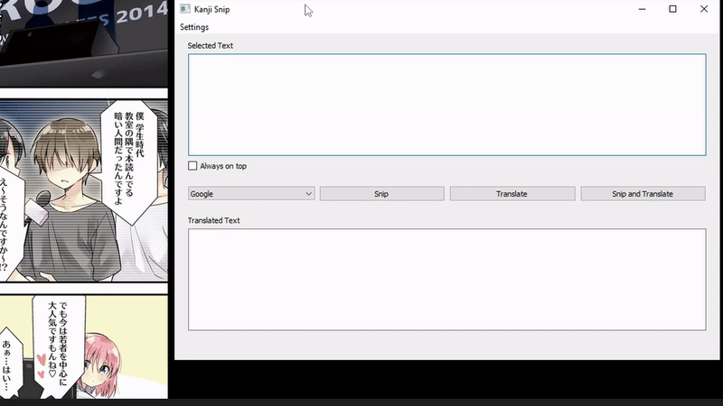

# Kanji Snip

Kanji Snip is a desktop application built with PyQt5 that allows users to translate screenshots from Japanese to English.

## Key Features

- **Text Extraction**: Extract text from images using Tesseract OCR.
- **Translation Services**: Translate extracted text using Google Translate or DeepL.
- **Jisho Lookup**: Quickly look up words in the Jisho dictionary directly from the app.
- **Translating highlighted parts**: Translate specific highlighted sections of the screen for greater flexibility.

## Installation

1. Clone the repository or download the ZIP file
2. Install the required python packages by executing ``install.bat`` or by running ``pip install -r requirements.txt`` in the command terminal.
3. Install Tesseract OCR.
   - Download and install Tesseract OCR for Windows from this [repository](https://github.com/UB-Mannheim/tesseract/wiki).
   - During ``Choose Components`` step ensure the following are selected:
      - ``Additional language data > Japanese``
      - ``Additional language data > Japanese (vertical)``
   - Follow the rest of the installation instructions.
4. Launch the program by executing ``run.bat`` or by running ``python kanji-snip.py`` in the command terminal.

### Optional Steps

1. **Configure Tesseract OCR Directory**:  
   If you changed the installation directory for Tesseract OCR, navigate to `Settings > Select File` and set the correct path to the installation folder.

2. **Setting Up DeepL Translation**:  
   - To use DeepL translation, you need an API key. Register for one at [DeepL's website](https://www.deepl.com/en/pro-api).  
   - Note: A free plan is available but requires credit card information.  
   - Once you have the API key, go to `Settings > API Key` and paste the key into the field.
